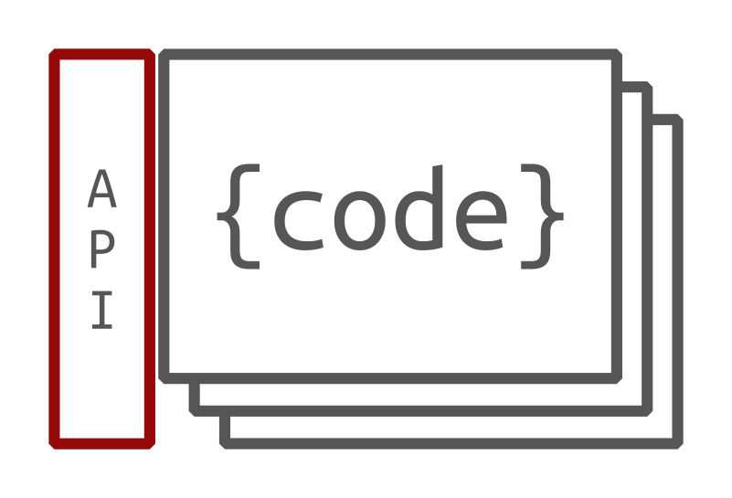
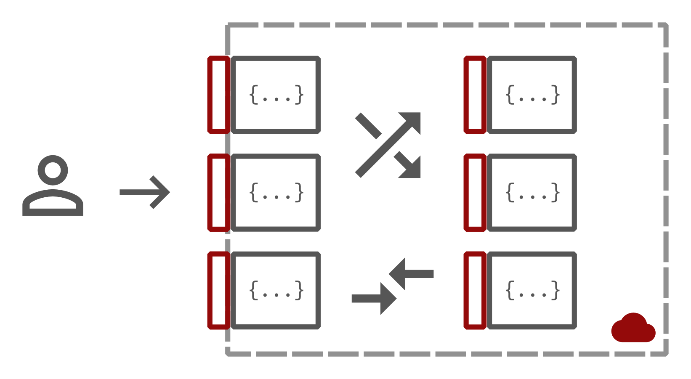
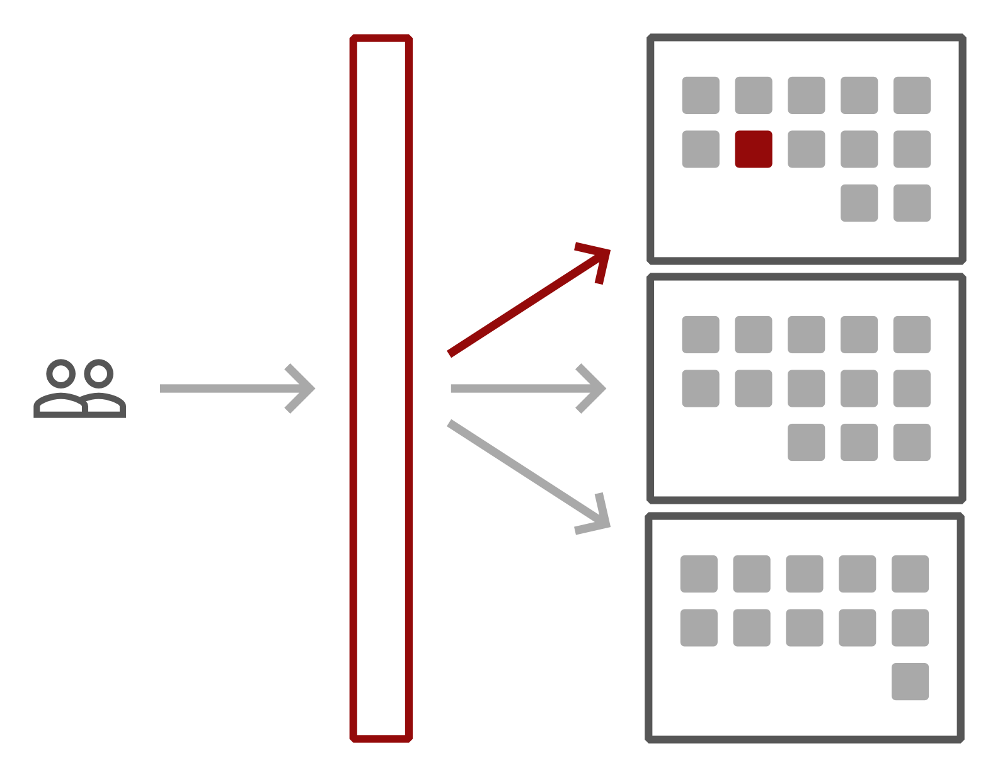

======================================================================

**Serverless + Microservices = ♥**

*The cloud platform that allows fast-moving teams to build and deploy microservice-oriented backends in the blink of an eye*

Lever OS is in **beta**. Please report bugs via [GitHub issues](https://github.com/leveros/leveros/issues)!

API reference
-------------

* For CLI reference run `lever --help` or `lever --help <command>`.
* lever.json reference (TODO)
* JavaScript API (TODO)
* [Golang API](./api/)

Getting started
---------------

### Prerequisites

* [Docker](https://docs.docker.com/engine/installation/) and [Docker
    Compose](https://docs.docker.com/compose/install/). On a Mac you
    can install [Docker Toolbox](https://docs.docker.com/toolbox/overview/) to
    get what you need.
* Make
* Linux or Mac (Windows should work too but it was never tested)

If you need to use docker-machine to run docker (eg on a Mac), you also need
to install [VirtualBox](https://www.virtualbox.org/wiki/Downloads) and then run
these commands to [get started](https://docs.docker.com/machine/get-started/):

```
$ docker-machine create --driver virtualbox default
$ eval `docker-machine env default`
```

You will need to run the second command for every new terminal window.

### Installation

```bash
$ git clone https://github.com/leveros/leveros
$ cd leveros
$ make pull-docker-images
$ make cli
$ sudo make install-cli
$ make fastrun
```

The commands above pull the necessary Docker images, install the `lever` CLI and
run a Lever OS instance locally.

### Your first Lever service

```bash
$ mkdir hello
$ cd hello
```

###### server.js

```javascript
module.exports.SayHello = function (name, callback) {
    callback(null, "Hello, " + name + "!");
}
```

###### lever.json

```json
{
    "name": "helloService",
    "description": "A hello service.",
    "jsEntry": "server.js"
}
```

Deploy your service locally

```bash
$ lever deploy dev.lever
```

###### Invoke via CLI

```bash
$ lever invoke lever://dev.lever/helloService/SayHello '"world"'
"Hello, world!"
```

(Remember to use proper JSON for arguments. This includes the quotes for
strings.)

###### Invoke via HTTP POST request

```bash
# Without docker-machine
$ curl -H "Content-Type: application/json" -X POST -d '["world"]' \
http://127.0.0.1:8080/helloService/SayHello?forceenv=dev.lever
"Hello, world!"
# With docher-machine
$ curl -H "Content-Type: application/json" -X POST -d '["world"]' \
http://$(docker-machine ip default):8080/helloService/SayHello?forceenv=dev.lever
"Hello, world!"
```

###### Invoke from JavaScript

```bash
$ npm install leveros
```

```javascript
var leveros = require("leveros");
var client = new leveros.Client();
client.forceHost = process.env.LEVEROS_IP_PORT;
var service = client.service("dev.lever", "helloService");
service.invoke("SayHello", "world", function (error, reply) {
    console.log(reply);  // Hello, world!
});
```

```bash
# Without docker-machine
$ LEVEROS_IP_PORT="127.0.0.1:8080" node client.js
# With docher-machine
$ LEVEROS_IP_PORT="$(docker-machine ip default):8080" node client.js
```

Setting LEVEROS_IP_PORT is necessary so that you can invoke the `dev.lever`
environment without adding an entry for it in `/etc/hosts` and setting the
listen port to `80`.

Basic concepts
--------------

### Services, Methods and Instances



Lever OS's basic building blocks are the **Services**. When you deploy a service
onto Lever you also need to specify an entry point. For example, in JavaScript,
the entry point is a module whose exported functions represent the **Methods**
of the service. The methods' signature define the API of the service.

*Code + Entry point = Service*

Your code is distributed across the Lever cloud and multiple
**instances** running your code are brought up (or none at all), depending on
the amount of requests the service is receiving. Lever OS handles the number of
instances automatically for you and constantly adjusts their number.

### Environments

Lever deployments support multiple, isolated **environments**. Although the
services from multiple environments share the nodes they run on, they are
completely isolated from each other by Docker.

Environments in Lever are identified via hostnames. The default environment
created as part of every local installation of Lever is `dev.lever` and has
an alias of `127.0.0.1:8080`, for convenience.

When running Lever in the cloud, you might use environments to separate staging
and production.

### Public vs Private services



Lever services may be either *public* (default) or *private*. You can change
this via the `private` property in `lever.json`.

Public services are accessible from outside the Lever environment while private
services are meant only as backends for services running in the same
environment.

### Invoking methods via RPC

Lever OS has a built-in RPC system that automatically handles instance
auto-discovery and loadbalancing.

Although the term RPC is often associated with communication between servers,
in Lever OS, RPCs can be either between two Lever services or across the
internet, between the client (browser / mobile app) and a Lever service.

There are two flavors of methods that you can use:
* **Regular methods**. This a standard request-reply RPC.
* **Streaming methods**. This is an RPC that opens up a channel between the
    caller and the Lever instance handling the RPC. Both the server and the
    client can then stream messages via the channel. This can be useful for push
    notifications or for real-time syncing. Streaming methods end with
    `Chan` or `_chan`, to distinguish from regular methods.

### Resources, sharding and routing

All RPCs sent to a service are loadbalanced between the instances of the
service. You should not assume that subsequent RPCs from a client are served
by the same instance.



**Unless!** you are using **resources**. Resources are duties that
stick to the instance they have been assigned to. They are identified by
arbitrary strings. If Lever has never seen that string before for a service, it
picks a random instance and associates it with that string. Then, all subsequent
requests tagged with that particular resource identifier will always be routed
to that instance. This allows building sharded backends where resources
are spread across a fleet of instances within a service and Lever automatically
routes requests to the relevant resource.

The resource identifier, if any, is passed as the first parameter to the method
that handles the request. It's the duty of the service implementation to use
it in order to distinguish between the multiple resources that may be handled
by the instance.

An example where resources might be useful is using the user's session ID as the
resource identifier. Each session would then be served consistently by the same
instance, allowing you to cache relevant session information in the instance's
memory.

### All together now

So, to recap, each Lever cloud contains multiple isolated **environments**,
each of which contains multiple **services**, each of which runs potentially
multiple **instances**, each of which potentially handles multiple
**resources**. Phew! That's a lot of one-to-many's.

```
Lever cloud  1⎯*  Environment  1⎯*  Service  1⎯*  Instance  1⎯*  Resource
```

FAQ
---

#### Is Lever OS a real OS?

Well, no, not really. At least, not in the traditional sense. It is a cloud
operating system. The name comes from the ultimate vision of this project: you
don't think about hardware when you write apps for desktop or mobile; similarly,
you shouldn't be thinking about servers or infrastructure when you develop apps
for the cloud.

#### Is this based on AWS Lambda?

Nope. Lever OS is not tied to a specific cloud in any way.

#### How does Lever OS differ from other lambda / serverless technologies?

The main advantages of Lever OS are

* **Open-source** (Apache License 2.0)
* **Cloud-agnostic**
* **Microservice-oriented**. It is very easy to interconnect multiple services
    in a complex backend and they can communicate via the built-in RPC system.
* **Also runs on your laptop**. This makes dev-test cycles very very efficient.
* **Designed for real-time serving**. No queues involved. Latency is minimal.
* **Supports streaming**

#### What sort of technology / infrastructure does Lever OS provide? What problems does it solve for me?

* **Orchestration** and **Resource management**.
* **Loadbalancing** requests between instances of a service.
* **Autoscaling** services.
* **Service auto-discovery** - no need to keep track of IPs and ports. Just call
    using the service name.
* **RPC** and an efficient binary JSON-like encoding.
* **Sharding** resources within a service. Useful if you need certain requests
    to be routed to the same instance consistently.
* **Streaming RPCs** useful for file-uploads, push notifications and
    real-time interaction / syncing.
* **Live upgrading** via `lever deploy`.

#### How does it work in more detail?

Lever OS is based on Docker. Running `make run` brings up an instance of
`leveroshost` on Docker.

When deploying a service onto Lever, the CLI takes the entire directory,
tar's it and uploads it to Lever. A special Lever service called `admin` handles
the upload and registers the new service internally.

Although not quite exact, a summary of what happens when a request for a
service comes in is as follows.
* A `leveroshost` instance receives it.
* `leveroshost` looks within the Lever cloud for nodes where instances of
    that service is running on. (If there are no instances of that service,
    `leveroshost` brings one up).
* `leveroshost` picks an instance randomly and routes the request to it.
* The instance serves the request and then continues to run for a while,
    waiting, in case other requests come in. After a certain period of time
    (a few minutes), if no requests come in, it is stopped automatically.
* In parallel, all the `leveroshost`s within a Lever cloud collectively keep
    track of the overall load of each service and scale them up or down
    accordingly (start / stop instances as necessary).

#### Can I persist data / run a database on Lever OS?

No. At least not yet. Persistence needs to be achieved via external
means (eg a DB-as-a-service).

#### Can existing legacy services interact with Lever services?

Absolutely! Just use the Lever client libraries to call into a Lever service
from a legacy service.

Also, you are free to use any library *within* the Lever service, which allows
you to call a legacy service from Lever.

Contributing
------------

* Please report bugs as
    [GitHub issues](https://github.com/leveros/leveros/issues).
* Join us on [Gitter](https://gitter.im/leveros/leveros)!
* Questions via GitHub issues also welcome!
* PRs welcome! But please give a heads-up in GitHub issue before starting work.
    If there is no GitHub issue for what you want to do, please create one.
* To build from source, check the [contributing](./doc/contributing.md) page.

Security Disclosure
-------------------

Security is very important to us. If you have any issue regarding security,
please disclose the information responsibly by sending an email to
`security [at] leveros.com` and not by creating a GitHub issue.

Licensing
---------

Lever OS is licensed under the Apache License, Version 2.0. See
[LICENSE.md](./LICENSE.md) for the full license text.
